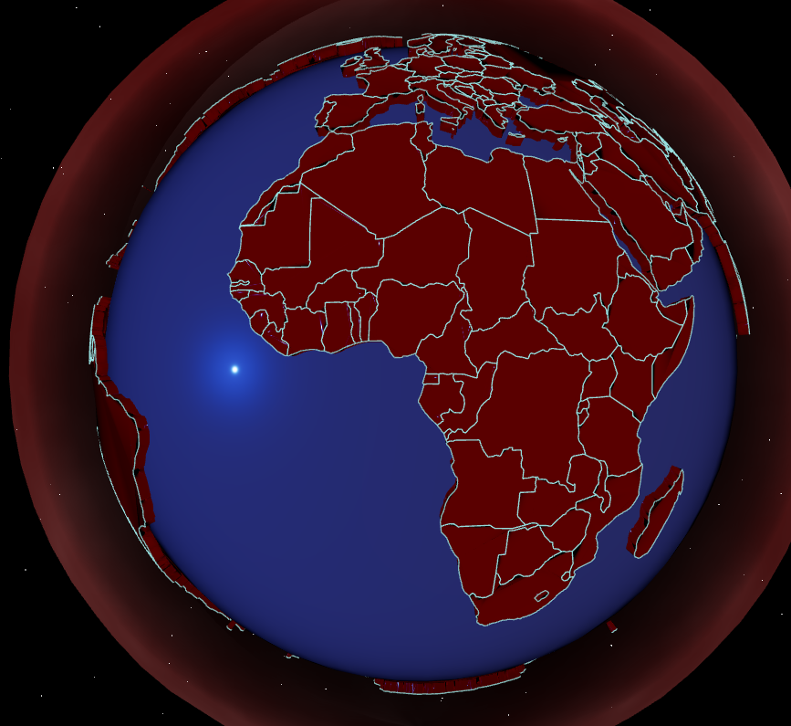

# CyberGlobe — Unified Geometry (v2.x)

**Visualisation 3D interactive de la Terre en WebGL/Three.js** avec architecture à géométrie unifiée.

---



> *État visuel du projet au 2026-01-07 — rendu atmosphérique, extrusion, et frontières précises.*

---

## 📖 Introduction

CyberGlobe est un projet de visualisation géographique 3D qui résout un problème fondamental : **séparer strictement la représentation visuelle des frontières de la géométrie volumique**.

### Problématique
Dans les visualisations 3D classiques, les frontières sont souvent dérivées des arêtes de triangulation des meshes, ce qui entraîne des incohérences géométriques. CyberGlobe adopte une approche radicalement différente :

> Les frontières visibles ne proviennent **pas** de la triangulation des meshes, mais directement des **coordonnées géographiques réelles** (longitude/latitude).

### Conséquences
- La triangulation sert **uniquement** à créer le volume
- Les frontières sont générées **indépendamment**, à partir des données sources GeoJSON
- Garantie de précision géographique et de cohérence visuelle

## 🏗 Architecture Technique

### 1. Géométrie Volumique (Pays)
- **Source** : Données GeoJSON (contours des pays)
- **Projection** : Conversion longitude/latitude → coordonnées sphériques
- **Extrusion** : Génération de volumes prismatiques par pays
- **Triangulation** : Utilisation d'Earcut exclusivement pour le volume
- **Dynamique** : Reconstruction à la volée lors des modifications paramétriques

### 2. Système de Frontières
- **Source unique** : Rings GeoJSON (contours réels)
- **Différenciation** :
  - Ring extérieur → frontière continentale
  - Rings internes → frontières internes (optionnelles)
- **Intelligence** : Indexation pour détection des frontières partagées
- **Rendu** : Décalage radial pour éviter le Z-fighting

### 3. Rendu & Éclairage
- **Atmosphère** : Shader personnalisé (corona animé avec noise GLSL)
- **Éclairage** :
  - Directionnelle (Soleil)
  - Rim light (halo latéral)
  - Ambiante (lumière douce uniforme)
- **Fonds étoilé** : Shader + particules aléatoires
- **Philosophie** : Lisibilité avant fioritures décoratives

## 🎮 Interface (Cockpit)

Interface paramétrique exposant exclusivement les réglages moteur.

### Géométrie
- Hauteur d'extrusion
- Rayon du globe
- Rayon de l'atmosphère

### Matériau (Verre/Pays)
- Transmission
- Rugosité
- Métallicité
- Clearcoat

### Atmosphère
- Intensité
- Couleurs (dégradé)

### Éclairage
- Intensité / Couleur (soleil)
- Intensité / Couleur (rim light)
- Lumière ambiante
- Position de la lumière

### Environnement
- Densité du brouillard
- Vitesse de rotation automatique
- Champ de vision (FOV)
- Couleur d’arrière-plan

### Presets
- Styles de matériau (neon, holo, matte…)
- Thèmes océans (obsidian, deep…)
- Environnements lumineux (cyberpunk, sunset…)

**Synchronisation** : Les valeurs UI sont liées à l'état interne au chargement.

## ⌨️ Contrôles Clavier

| Touche | Fonction |
|--------|----------|
| **B** | Basculer l'affichage des frontières internes |
| **S** | Afficher uniquement les frontières partagées |

## 📊 Données Géographiques

- **Format** : GeoJSON
- **Source** : [world.geo.json](https://github.com/johan/world.geo.json)
- **Intégrité** : Données utilisées sans modification sémantique
- **Précision** : Aucune simplification automatique à ce stade

## ⚙️ Choix Techniques Assumés

### ✅ Ce qui est fait
- Frontières issues des coordonnées géographiques réelles
- Découplage strict géométrie/rendu
- Priorité à la lisibilité et cohérence
- Reconstruction dynamique paramétrique
- Halo atmosphérique avec shader GLSL custom

### ❌ Ce qui n'est pas fait
- Wireframe basé sur les arêtes de triangles
- Frontières dérivées de la triangulation
- Effets décoratifs non maîtrisés
- Optimisations avancées (LOD, instancing, batching)

## 📈 État du Projet

| Composant | Statut |
|-----------|--------|
| Architecture | ✅ Stabilisée |
| Découplage géométrie/frontières | ✅ Implémenté |
| Reconstruction dynamique | ✅ Fonctionnelle |
| Stack visuelle shaderisée | ✅ Expérimentale |
| Produit final | ⏳ Conceptuel |

**Note** : Ce dépôt fige un **état sain et cohérent**, servant de base solide pour des itérations futures.

## 🛠 Stack Technique

- **Moteur 3D** : Three.js (ESM)
- **Rendu** : WebGL
- **Shaders** : GLSL (Vertex/Fragment)
- **Triangulation** : Earcut
- **Données** : GeoJSON
- **Frontend** : HTML/CSS/JavaScript vanilla

**Simplicité** : Aucune étape de build, aucun bundler.

## 🚀 Exécution

```bash
# Cloner le dépôt
git clone [url-du-depot]

# Ouvrir dans un navigateur moderne
open index.html
# ou
xdg-open index.html
# ou simplement double-cliquer sur index.html
